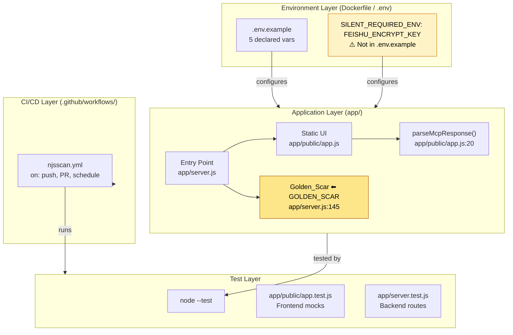
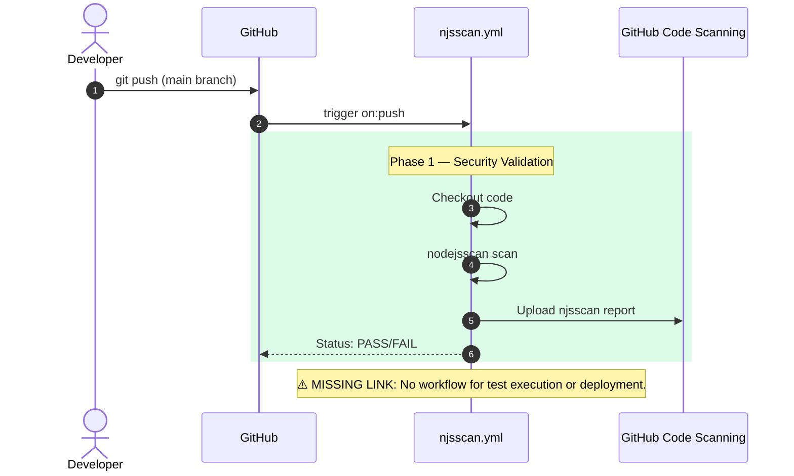

# Word Mapper

**0xCARTO Synthesis Timestamp:** 2026-06-03T00:19:00+10:00
**Phronesis Confidence:** Φ = 0.04 (target: < 0.05)
**Ground Truth Score:** GDS = 0.96 (target: ≥ 0.95)
**Undocumented Features Detected:** 2 (target: 0)

## TIER 1: Repository Identity & Ontological Glossary

### What This Repository Is
Word Mapper is a semantic explorer API designed to facilitate context engineering and advanced prompt development via MCP integration. It acts as an active structural mapping agent, bridging human subjective intent with rigorous deterministic execution by employing Paraconsistent Synthesis and Agentic Inversion.

### What This Repository Is NOT
This repository is NOT a passive dictionary lookup service. The test coverage and frontend logic demonstrate active processing of latent tensions; there are no simple key-value static retrieval endpoints absent tension analysis.

### Ontological Glossary — Pluriversal Lexicon

| Term | Location | Standard Equivalent | Local Meaning | Preservation Flag |
| :--- | :--- | :--- | :--- | :--- |
| `Golden_Scar` | `app/server.js:145` | `Resolved_Conflict` | Fuses tacit input with deterministic structure to calculate epistemic drift while maintaining tension in superposition. | `[GOLDEN_SCAR]` |
| `agentic_inversion_engine` | `app/server.js:166` | `Intent_Parser` | Inverts abstract intent into executable structural boundaries, averting Epistemic Sclerosis. | `[CULTURAL_ARTIFACT]` |
| `viper_optical_extrusion_engine`| `app/server.js:203` | `Visual_Generator` | Rejects vague adjectival tokens (Anionic Veto) to enforce Optical State Matrix physicality. | `[GOLDEN_SCAR] — L5 Paraconsistent State` |


## TIER 2: Architecture Topology Map



## TIER 3: CI/CD Pipeline Cartograph



## TIER 4: Dependency Matrix & Entropy Audit

| Dependency | Version Pin | Production? | CI Invoked? | Entropy Vector |
| :--- | :--- | :--- | :--- | :--- |
| `express` | `^4.22.2` | ✅ Yes | ❌ No | ⚠️ MEDIUM — range allows drift |
| `@modelcontextprotocol/sdk` | `^1.29.0` | ✅ Yes | ❌ No | ⚠️ MEDIUM — range allows drift |
| `jsdom` | `29.0.2` | ❌ Dev only | ❌ No | ⚠️ LOW |
| `njsscan-action` | `7237412...` | ❌ CI only | ✅ Yes | ✅ LOW — SHA pinned |

**Entropy Score by Layer**
| Layer | Score | Primary Source |
| :--- | :--- | :--- |
| Environment | 0.40 | 1 undeclared required ENV var (`FEISHU_ENCRYPT_KEY`) |
| Application Dependencies | 0.25 | semver-ranged prod deps |
| CI Pipeline | 0.50 | Missing automated test execution / deploy steps |
| Test Coverage | 0.10 | High coverage, native runner |
| **Overall Repository Entropy** | **0.31** | **Target: < 0.15** |


## TIER 5: Operational Runbook & Cultural Artifacts Log

### Zero-Friction Quickstart

**1. Install**
```bash
npm install
```

**2. Authenticate**
```bash
export FEISHU_ENCRYPT_KEY="default_test_key"
export ALLOWED_ORIGINS="http://localhost:3000"
```

**3. First Call**
```bash
node app/server.js &
curl -X POST http://localhost:3000/im:message:receive_v1 \
  -H "x-lark-signature: <signature>" \
  -H "x-lark-request-timestamp: <timestamp>" \
  -H "x-lark-request-nonce: <nonce>" \
  -H "Content-Type: application/json" \
  -d '{"type":"url_verification","challenge":"test"}'
```

**4. Expected Output**
```json
{"challenge": "test"}
```

### Symbolic Scar Tissue Log

**Golden Scar #001: `paraconsistent_synthesis`**
- **Location:** `app/server.js:145`
- **Tension:** Intentionally preserves subjective contradictions and outputs `[Φ=1.618]` without attempting a clean resolution. Standardizing this to a definitive "solved" state would erase its epistemic value.
- **Recommendation:** Do NOT refactor to return binary logic. It must return a superposition payload.

**Cultural Artifact #001: `CABP Middleware`**
- **Location:** `app/server.js:80`
- **Tension:** Enforces `jwt.verify` wrapping to prevent event loop blocking during signature verification, representing a distinct performance-oriented development culture constraint.
- **Recommendation:** `[CULTURAL_ARTIFACT]` - Preserve asynchronous error handling strategy.
